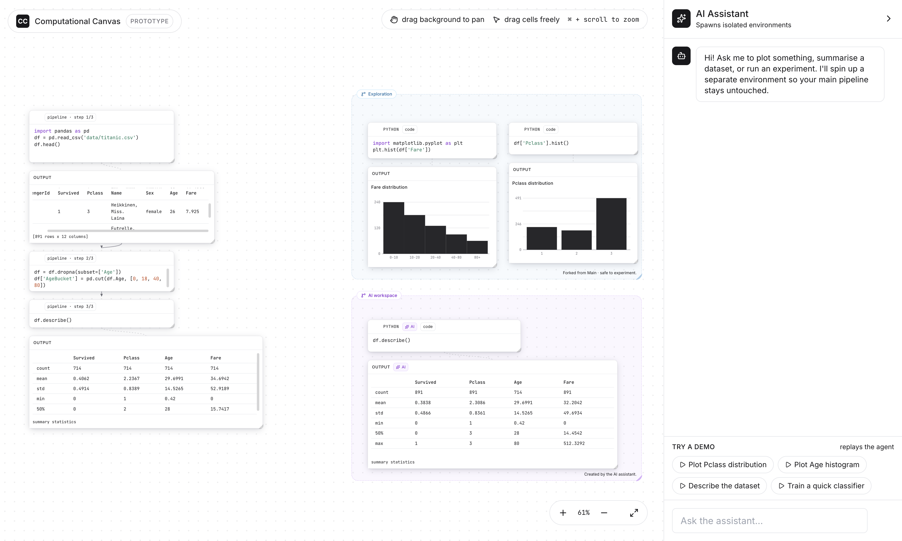

# Computational Canvas

A two-dimensional successor to the computational notebook — a freeform spatial workspace for code cells, rich outputs, and isolated runtime environments, built for richer human–AI collaboration inside the IDE.

<p align="center">
  
</p>

<p align="center">
  <em>The web prototype during the &ldquo;Train a quick classifier&rdquo; demo: the main pipeline on the left, a forked training environment on the right with the AI agent marker parked on the cell it just executed, and the assistant's narration in the chat panel.</em>
</p>

This repository accompanies the paper *Evolving the Computational Notebook: A Two-Dimensional Canvas for Enhanced Human-AI Interaction* (IEEE/ACM IDE Workshop, 2025) — the full PDF is in [`misc/paper.pdf`](misc/paper.pdf).

> **Status: research prototype.** The work in this repo is exploratory and intentionally limited in scope. The goal is to validate the interaction ideas from the paper and to invite contributors who want to help turn it into a real, daily-driver IDE tool. **If the ideas resonate, please get in touch — see [Contributing & collaboration](#contributing--collaboration) below.**

---

## Why a canvas instead of a notebook?

Jupyter-style notebooks are great for exploration, but their single linear column fights against how data work actually happens:

- Real workflows are non-linear — you branch, backtrack, compare alternatives, and revisit early cells repeatedly.
- Cell order rarely matches execution order, which is a known source of reproducibility issues.
- AI assistants make this worse, not better, when they edit several interdependent cells inside a linear scroll: it becomes hard to see what the agent changed, in what order, and why.

The Computational Canvas keeps the stateful, REPL-style execution model that makes notebooks productive, and replaces the linear page with an infinite 2D plane.

## Core concepts from the paper

### 1. Free-form cell arrangement

Cells are not bound to a grid or a column. You can drag them anywhere on an infinite canvas and group them spatially — by topic, by experiment, by collaborator. The intent is closer to a Miro-style board than to a document. Linear order stops being the primary affordance, so the interface no longer pushes you toward a rigid pipeline when your actual work is exploratory.

### 2. Rich, detachable outputs

Executing a cell produces an output cell next to it. Re-running the cell updates that output in place, even if you've moved the output far from its source. Outputs can also be **detached** — frozen at their current state and kept as a record. This lets you separate "where I write code" from "where I keep the results that matter," and supports a presentation-ready trail of the experiment without manually copying figures or tables.

### 3. Separate environments via forking

A cell's first execution creates the **main runtime**. From there you can spawn additional environments that fork the main runtime's state — they inherit variables and imports up to the fork point, then evolve independently. This makes destructive experiments safe: mutate the dataframe, try a different preprocessing strategy, train a heavy model — none of it can corrupt the main pipeline. Visually each environment is a coloured region you can move, resize, and dispose of.

### 4. Collaborative exploration

Because environments are first-class, they're a natural unit for collaboration. Multiple people (or multiple agents) can share a canvas while owning their own runtime, with shared spaces for joint work. The emphasis is on brainstorming and gathering insights — generating plots, tables, and intermediate artifacts — rather than on co-authoring production code.

### 5. Human–AI interaction as a first-class workflow

When you ask an AI assistant to do something, it doesn't silently rewrite your cells. Instead, the agent spawns its own environment, writes and executes code there, and shows the result. You can see exactly what the agent did, where it did it, and what the intermediate state was. Forking gives you a built-in safety boundary; the 2D layout makes the agent's contribution spatially separable from your own work. Different agent roles can coexist on the same canvas: data exploration, documentation, debugging, brainstorming.

### 6. IDE integration

The paper describes an implementation of these ideas as a Visual Studio Code plugin. Canvases live in `.2dntb` files, with bidirectional compatibility to standard `.ipynb` notebooks (load a notebook into the canvas, save the canvas back to a notebook in cell-creation order). A local server manages canvases and forked Python REPL sessions, and a public HTTP API lets external AI agents drive the canvas without being baked into the UI.

## What's in this repository

```
cc-canvas/
├── misc/
│   ├── paper.pdf        # The IDE Workshop paper
│   └── prototype.png    # Screenshot used at the top of this README
├── prototype/           # Web prototype that demonstrates the interaction ideas
│   └── src/             #   - free-form cells, pipelines, environment forking,
│                        #     output management, scripted AI demos
└── .github/workflows/   # GitHub Actions: deploys the prototype to GitHub Pages
```

The Python canvas server described in §IV of the paper (FastAPI + `ipykernel` forking, `.2dntb` files, HTTP API for AI agents) is **not** in this repo yet — it's one of the main things we're looking for collaborators to help build (see [Contributing & collaboration](#contributing--collaboration)).

The web prototype under `prototype/` is the most complete piece. It's a self-contained React + TypeScript + Vite app with a simulated Python execution engine, so you can play with the interactions without any backend. It demonstrates:

- Free-form drag-and-drop cells on an infinite, pan/zoomable canvas
- A "main pipeline" of sequenced cells in the main runtime, plus free-form cells anywhere
- Forked environments, drawn as coloured regions you can move and resize
- Code → output linkage, with detachable outputs
- An AI assistant panel with scripted demo scenarios that play back agent behaviour: spawn an environment, write cells, run them, reflect, refine, re-run

## Running the prototype

The prototype is a standard Vite app.

```bash
cd prototype
npm install
npm run dev
```

Then open the URL Vite prints (usually `http://127.0.0.1:5173/`). Click any of the "Try a demo" buttons in the right-hand chat panel to watch a scripted agent build, run, and refine cells.

## Deploying as a GitHub Pages site

A GitHub Actions workflow at `.github/workflows/deploy-pages.yml` builds the Vite prototype and publishes it to GitHub Pages on every push to `main`. The base path is computed automatically, so it works whether the repo is a project page (`<user>.github.io/<repo>/`) or a user/org site (`<user>.github.io/`) — no manual config in `vite.config.ts` needed.

One-time setup after creating the repository on GitHub:

1. In the repo, go to **Settings → Pages**.
2. Under **Build and deployment → Source**, select **GitHub Actions**.
3. Push to `main`. The workflow will run, build `prototype/`, and publish the site. The Pages URL appears in the workflow's `deploy` job summary, and any subsequent push to `main` re-deploys.

Manual rebuild without a code change: **Actions → Deploy prototype to GitHub Pages → Run workflow**.

## Contributing & collaboration

**This is the part that matters most.** Everything in this repo is a sketch. The interaction ideas have been validated on paper and in a research-grade VS Code plugin, but turning the canvas into something a working data scientist would reach for every day is a much larger effort than two people can take on alone.

If any of the following sounds interesting, please reach out:

- **IDE integration.** A production-quality VS Code (or JetBrains) extension: editor host, file format, diff/merge, version control story, performance with large notebooks.
- **Runtime layer.** A robust forking model for Python kernels (and beyond), efficient state snapshots, hand-off between environments, multi-language support.
- **Collaboration.** Real-time multi-user editing on the canvas, presence, permissions per environment, conflict resolution.
- **AI agent SDK.** A clean API and protocol for third-party agents to read the canvas, propose changes, and execute inside scoped environments — without having to embed themselves in the UI.
- **HCI research.** Empirical studies of how developers actually use a 2D canvas for data work, what spatial patterns emerge, and how to design AI affordances that stay legible at scale.
- **Design and frontend.** UX for outputs, navigation on infinite canvases, minimaps, search, accessibility.

Issues, discussions, and PRs are all welcome. If you'd rather start a conversation directly, email the authors (addresses are on the paper) or open an issue describing what you'd like to work on.

## Citation

If you build on these ideas in academic work, please cite:

```bibtex
@inproceedings{grotov2025evolving,
  title={Evolving the Computational Notebook: A Two-Dimensional Canvas for Enhanced Human-AI Interaction},
  author={Grotov, Konstantin and Botov, Dmitry},
  booktitle={2025 IEEE/ACM Second IDE Workshop (IDE)},
  pages={21--25},
  year={2025},
  organization={IEEE}
}
```
